# Fáza 0 — Návrh databázy (v1)

> Referenčný dokument pre celý projekt. Žiadny kód sa nepíše, kým toto nie je
> odsúhlasené. Migrácie a modely v Express vrstve budú presne kopírovať to,
> čo je tu napísané.

---

## 1. Technické špecifikácie

| Vec | Hodnota |
|---|---|
| Engine | MariaDB 10.11+ (kompatibilné s MySQL 8) |
| Storage engine | InnoDB |
| Charset / collation | `utf8mb4` / `utf8mb4_unicode_ci` |
| Časové zóny | Všetky `DATETIME` v UTC, prevod do CET v aplikácii |
| Primary keys | `BIGINT UNSIGNED AUTO_INCREMENT` (room na rast) |
| Cudzie kľúče | `ON DELETE` špecifikované per tabuľka — väčšinou `RESTRICT`, výnimočne `CASCADE` (junction tabuľky) alebo `SET NULL` |
| JSON | Natívny `JSON` typ (alias pre `LONGTEXT` + `JSON_VALID` check v MariaDB) |
| Migrácie | `knex.js` migrations — každá zmena schémy je verziovaný JS súbor v `/backend/migrations/` |
| Seedy | Tiež cez `knex` v `/backend/seeds/` |

---

## 2. Konvencie

- **Tabuľky:** `snake_case`, množné číslo (`articles`, `comments`, `media`)
- **Junction tabuľky:** `noun_noun` v abecednom poradí (`article_categories`, nie `category_articles`)
- **Stĺpce:** `snake_case`, jednotné číslo
- **Cudzie kľúče:** `<entity>_id` (napr. `author_id`, `parent_id`)
- **Boolean:** `is_*` alebo `has_*` (`is_featured`, `is_filterable`), `TINYINT(1)`
- **Časové stĺpce:** `created_at`, `updated_at`, `deleted_at`, `published_at`, `scheduled_at`, `expires_at`
- **Enum stĺpce:** vždy s defaultom, hodnoty sa nemažú (len pridávajú nové)
- **Indexy:** `idx_<tabuľka>_<stĺpce>`, unique `uq_<tabuľka>_<stĺpce>`, fulltext `ft_<tabuľka>_<stĺpec>`

---

## 3. ERD prehľad

> Mermaid diagram. Vlož do https://mermaid.live alebo otvor v GitHub-e na vizualizáciu.

```mermaid
erDiagram
    users ||--o{ user_social_links : "has"
    users ||--o{ user_security_answers : "has"
    users ||--o{ user_bans : "may be banned"
    users ||--o{ sessions : "owns"
    users ||--o{ articles : "authors"
    users ||--o{ comments : "writes"
    users ||--o{ comment_likes : "likes"
    users ||--o{ comment_reports : "reports"
    users ||--o{ media : "uploads"
    security_questions ||--o{ user_security_answers : "answered by"

    articles ||--o{ article_revisions : "has history"
    articles ||--o{ article_categories : ""
    articles ||--o{ article_rubrics : ""
    articles ||--o{ article_tags : ""
    articles ||--o{ article_related : "manual relations"
    articles ||--o{ comments : "receives"
    articles ||--o{ ranking_items : "appears in"
    articles ||--o{ page_visits : "is viewed"
    categories ||--o{ article_categories : ""
    categories ||--o{ categories : "parent_of"
    rubrics ||--o{ article_rubrics : ""
    tags ||--o{ article_tags : ""

    media ||--o{ media_usages : "tracked in"
    articles ||--o{ media_usages : "uses"
    pages ||--o{ media_usages : "uses"

    rankings ||--o{ ranking_criteria : "has"
    rankings ||--o{ ranking_items : "contains"
    ranking_items ||--o{ ranking_item_values : "has values"
    ranking_criteria ||--o{ ranking_item_values : "evaluated by"

    banner_positions ||--o{ banner_placements : ""
    banner_positions ||--o{ sliders : "rendered at"
    banners ||--o{ banner_placements : ""
    sliders ||--o{ slider_slides : "has"

    pages ||--o{ page_visits : "is viewed"

    comments ||--o{ comments : "replies"
    comments ||--o{ comment_likes : ""
    comments ||--o{ comment_reports : ""
```



---

## 4. Tabuľky

> Všetky tabuľky majú `id BIGINT UNSIGNED PK AUTO_INCREMENT`, `created_at DATETIME NOT NULL DEFAULT CURRENT_TIMESTAMP`, `updated_at DATETIME NOT NULL DEFAULT CURRENT_TIMESTAMP ON UPDATE CURRENT_TIMESTAMP`. Uvedené sú len tam, kde sa od defaultu odlišujú.

---

### 4.1 Používatelia a autentifikácia

#### `users`
Centrálna tabuľka pre admina, editorov aj čitateľov.

| Stĺpec | Typ | NULL | Default | Pozn. |
|---|---|---|---|---|
| id | BIGINT UNSIGNED PK | | | |
| role | ENUM('admin','editor','reader') | NO | 'reader' | |
| nickname | VARCHAR(64) | NO | | unique |
| email | VARCHAR(255) | YES | NULL | unique (NULL nekonfliktuje) |
| password_hash | VARCHAR(255) | NO | | bcrypt cost 12 |
| avatar_media_id | BIGINT UNSIGNED FK→media.id | YES | NULL | ON DELETE SET NULL |
| bio | TEXT | YES | NULL | |
| location | VARCHAR(120) | YES | NULL | |
| birth_date | DATE | YES | NULL | |
| custom_field_label | VARCHAR(64) | YES | NULL | názov vlastného poľa profilu |
| custom_field_value | VARCHAR(255) | YES | NULL | obsah vlastného poľa |
| gdpr_accepted_at | DATETIME | YES | NULL | NULL = nesúhlasil/legacy |
| is_banned | TINYINT(1) | NO | 0 | flag pre rýchly check pri logine |
| last_login_at | DATETIME | YES | NULL | |
| created_at | DATETIME | NO | CURRENT_TIMESTAMP | |
| updated_at | DATETIME | NO | CURRENT_TIMESTAMP ON UPDATE | |

**Indexy:**
- `uq_users_nickname` UNIQUE (nickname)
- `uq_users_email` UNIQUE (email)
- `idx_users_role` (role)
- `idx_users_is_banned` (is_banned)

**Pozn.:** Email je nepovinný — pri registrácii čitateľa sa nepýta. Admin/editor ho má vždy. Reset hesla iba cez bezpečnostnú otázku.

#### `security_questions`
Predvolený zoznam otázok, admin ich spravuje.

| Stĺpec | Typ | NULL | Pozn. |
|---|---|---|---|
| id | BIGINT UNSIGNED PK | | |
| text | VARCHAR(255) | NO | napr. „Meno prvého psa" |
| is_active | TINYINT(1) | NO | default 1 |

#### `user_security_answers`
Používateľ môže mať predvolenú otázku alebo úplne vlastnú. Práve jeden zo stĺpcov `question_id` / `custom_question` musí byť NOT NULL — riešené aplikačne, nie DB constraint.

| Stĺpec | Typ | NULL | Pozn. |
|---|---|---|---|
| id | BIGINT UNSIGNED PK | | |
| user_id | BIGINT UNSIGNED FK→users.id ON DELETE CASCADE | NO | |
| question_id | BIGINT UNSIGNED FK→security_questions.id ON DELETE RESTRICT | YES | |
| custom_question | VARCHAR(255) | YES | |
| answer_hash | VARCHAR(255) | NO | bcrypt |

**Indexy:**
- `idx_user_security_answers_user` (user_id)

#### `user_social_links`

| Stĺpec | Typ | NULL | Pozn. |
|---|---|---|---|
| id | BIGINT UNSIGNED PK | | |
| user_id | BIGINT UNSIGNED FK→users.id ON DELETE CASCADE | NO | |
| platform | ENUM('instagram','youtube','facebook','website','steam','twitter','tiktok','discord','github') | NO | |
| url | VARCHAR(500) | NO | |

**Indexy:**
- `idx_user_social_links_user` (user_id)
- `uq_user_social_links_user_platform` UNIQUE (user_id, platform)

#### `user_bans`
Audit log banov. Aj keď `users.is_banned=1`, história zostáva tu.

| Stĺpec | Typ | NULL | Pozn. |
|---|---|---|---|
| id | BIGINT UNSIGNED PK | | |
| user_id | BIGINT UNSIGNED FK→users.id ON DELETE CASCADE | NO | |
| banned_by | BIGINT UNSIGNED FK→users.id ON DELETE SET NULL | YES | admin |
| reason | TEXT | YES | |
| unbanned_at | DATETIME | YES | NULL = stále zabanovaný |

#### `sessions`
Server-side sessions, ukladané v DB (nie v pamäti — prežijú reštart).

| Stĺpec | Typ | NULL | Pozn. |
|---|---|---|---|
| sid | CHAR(64) PK | NO | nie auto-increment |
| user_id | BIGINT UNSIGNED FK→users.id ON DELETE CASCADE | NO | |
| ip | VARBINARY(16) | YES | binárne IP (v4 aj v6) |
| user_agent | VARCHAR(255) | YES | |
| expires_at | DATETIME | NO | |
| created_at | DATETIME | NO | CURRENT_TIMESTAMP |

**Indexy:**
- `idx_sessions_user` (user_id)
- `idx_sessions_expires` (expires_at) — pre cron cleanup

#### `login_attempts`
Pre rate limiting a detekciu brute-force.

| Stĺpec | Typ | NULL | Pozn. |
|---|---|---|---|
| id | BIGINT UNSIGNED PK | | |
| identifier | VARCHAR(255) | NO | nickname alebo email použitý pri pokuse |
| ip | VARBINARY(16) | YES | |
| success | TINYINT(1) | NO | |
| attempted_at | DATETIME | NO | CURRENT_TIMESTAMP |

**Indexy:**
- `idx_login_attempts_identifier_time` (identifier, attempted_at)
- `idx_login_attempts_ip_time` (ip, attempted_at)

Cron: zmazať záznamy staršie ako 24h.

---

### 4.2 Taxonómia

#### `rubrics`
Veľké sekcie webu („Recenzie", „Návody", „Aktuality"). Ploché, žiadna hierarchia.

| Stĺpec | Typ | NULL | Pozn. |
|---|---|---|---|
| id | BIGINT UNSIGNED PK | | |
| name | VARCHAR(80) | NO | |
| slug | VARCHAR(120) | NO | unique |
| description | TEXT | YES | |
| display_order | INT | NO | default 0 |

**Indexy:**
- `uq_rubrics_slug` UNIQUE (slug)

#### `categories`
Hierarchická produktová oblasť. Materializovaný `path` pre rýchle dotazy.

| Stĺpec | Typ | NULL | Pozn. |
|---|---|---|---|
| id | BIGINT UNSIGNED PK | | |
| name | VARCHAR(80) | NO | |
| slug | VARCHAR(120) | NO | unique globálne |
| parent_id | BIGINT UNSIGNED FK→categories.id ON DELETE RESTRICT | YES | NULL = root |
| path | VARCHAR(500) | NO | napr. `telefony/android/samsung` |
| description | TEXT | YES | |
| display_order | INT | NO | default 0 |

**Indexy:**
- `uq_categories_slug` UNIQUE (slug)
- `idx_categories_parent` (parent_id)
- `idx_categories_path` (path)

**Pozn.:** `path` udržiava aplikácia — pri zmene rodiča treba prepočítať aj všetkých potomkov. Dotaz „všetky články v kategórii vrátane podkategórií" = `WHERE category.path LIKE 'telefony/%'`.

#### `tags`
Ploché, s farbou.

| Stĺpec | Typ | NULL | Pozn. |
|---|---|---|---|
| id | BIGINT UNSIGNED PK | | |
| name | VARCHAR(64) | NO | |
| slug | VARCHAR(120) | NO | unique |
| color | CHAR(7) | YES | hex `#RRGGBB`, NULL = default |
| description | TEXT | YES | |

**Indexy:**
- `uq_tags_slug` UNIQUE (slug)

---

### 4.3 Mediálna knižnica

#### `media`

| Stĺpec | Typ | NULL | Pozn. |
|---|---|---|---|
| id | BIGINT UNSIGNED PK | | |
| type | ENUM('image','video','youtube') | NO | |
| original_path | VARCHAR(500) | YES | NULL pre type='youtube' |
| thumbnail_path | VARCHAR(500) | YES | generované pre obrázky a videá |
| youtube_url | VARCHAR(500) | YES | použité ak type='youtube' |
| youtube_video_id | VARCHAR(20) | YES | extrahované z URL pre embed |
| mime | VARCHAR(120) | YES | |
| size_bytes | BIGINT UNSIGNED | YES | |
| width | INT | YES | |
| height | INT | YES | |
| duration_seconds | INT | YES | len video |
| original_filename | VARCHAR(255) | NO | pre vyhľadávanie |
| alt_text | VARCHAR(255) | YES | pre prístupnosť a SEO |
| caption | TEXT | YES | |
| uploader_id | BIGINT UNSIGNED FK→users.id ON DELETE SET NULL | YES | |

**Indexy:**
- `idx_media_uploader` (uploader_id)
- `idx_media_type_created` (type, created_at)
- `ft_media_filename_alt` FULLTEXT (original_filename, alt_text, caption)

**Storage konvencia (v aplikácii):**
- `/uploads/originals/YYYY/MM/<uuid>.<ext>` — originál (plná kvalita, žiadna kompresia)
- `/uploads/thumbnails/YYYY/MM/<uuid>_thumb.webp` — 400px wide WebP
- `/uploads/thumbnails/YYYY/MM/<uuid>_medium.webp` — 1200px wide WebP (pre lightbox preview)
- `/uploads/videos/YYYY/MM/<uuid>.<ext>` — videá nedotknuté

#### `media_usages`
Index, kde sa médium používa. Udržiavaný automaticky pri uložení článku/stránky.

| Stĺpec | Typ | NULL | Pozn. |
|---|---|---|---|
| id | BIGINT UNSIGNED PK | | |
| media_id | BIGINT UNSIGNED FK→media.id ON DELETE CASCADE | NO | |
| usage_type | ENUM('article_cover','article_block','page_block','user_avatar','banner','slider','og_image') | NO | |
| article_id | BIGINT UNSIGNED FK→articles.id ON DELETE CASCADE | YES | |
| page_id | BIGINT UNSIGNED FK→pages.id ON DELETE CASCADE | YES | |
| user_id | BIGINT UNSIGNED FK→users.id ON DELETE CASCADE | YES | |
| banner_id | BIGINT UNSIGNED FK→banners.id ON DELETE CASCADE | YES | |
| slide_id | BIGINT UNSIGNED FK→slider_slides.id ON DELETE CASCADE | YES | |

**Indexy:**
- `idx_media_usages_media` (media_id)
- `idx_media_usages_article` (article_id)

**Pozn.:** Mazanie média v admine je blokované, kým existujú riadky tu — alebo je potrebný "force delete" s upozornením.

---

### 4.4 Články

#### `articles`

| Stĺpec | Typ | NULL | Pozn. |
|---|---|---|---|
| id | BIGINT UNSIGNED PK | | |
| type | ENUM('article','review') | NO | default 'article' |
| title | VARCHAR(255) | NO | |
| slug | VARCHAR(255) | NO | unique globálne |
| excerpt | TEXT | YES | krátky popis pre listing |
| cover_media_id | BIGINT UNSIGNED FK→media.id ON DELETE SET NULL | YES | |
| author_id | BIGINT UNSIGNED FK→users.id ON DELETE RESTRICT | NO | |
| status | ENUM('draft','scheduled','published','archived','trash') | NO | default 'draft' |
| published_at | DATETIME | YES | |
| scheduled_at | DATETIME | YES | použité pri status='scheduled' |
| deleted_at | DATETIME | YES | čas presunu do koša |
| is_featured | TINYINT(1) | NO | default 0 |
| content | JSON | NO | pole blokov (sekcia 5) |
| search_text | MEDIUMTEXT | NO | plain text extrakt z content pre fulltext |
| view_count | INT UNSIGNED | NO | default 0, denormalizovaný počet (pre rýchly listing) |
| default_related_strategy | ENUM('manual','auto','both') | NO | default 'both' |
| seo_title | VARCHAR(255) | YES | NULL = použiť title |
| seo_description | VARCHAR(320) | YES | NULL = použiť excerpt |
| og_image_media_id | BIGINT UNSIGNED FK→media.id ON DELETE SET NULL | YES | NULL = použiť cover |

**Indexy:**
- `uq_articles_slug` UNIQUE (slug)
- `idx_articles_status_published` (status, published_at)
- `idx_articles_type_status_published` (type, status, published_at)
- `idx_articles_author` (author_id)
- `idx_articles_featured` (is_featured, published_at)
- `idx_articles_deleted` (deleted_at) — pre cron cleanup koša
- `ft_articles_search` FULLTEXT (title, search_text)

**Pozn.:**
- `view_count` sa zvyšuje atomicky pri page view, ale autoritatívny zdroj sú `page_visits`
- `search_text` sa generuje pri save z `content` (extrakcia textu z blokov)
- Cron raz denne: zmaže riadky kde `status='trash' AND deleted_at < NOW() - 30 days`

#### `article_revisions`
Posledných 5 verzií, FIFO orezávanie aplikačne pri každom save.

| Stĺpec | Typ | NULL | Pozn. |
|---|---|---|---|
| id | BIGINT UNSIGNED PK | | |
| article_id | BIGINT UNSIGNED FK→articles.id ON DELETE CASCADE | NO | |
| title | VARCHAR(255) | NO | snapshot |
| content | JSON | NO | snapshot |
| excerpt | TEXT | YES | snapshot |
| editor_id | BIGINT UNSIGNED FK→users.id ON DELETE SET NULL | YES | kto urobil zmenu |

**Indexy:**
- `idx_article_revisions_article_created` (article_id, created_at)

Pri save: vlož novú verziu, potom zmaž najstaršie nad limit 5 (per article_id).

#### `article_categories` (M:N junction)
| Stĺpec | Typ | Pozn. |
|---|---|---|
| article_id | BIGINT UNSIGNED FK→articles.id ON DELETE CASCADE | |
| category_id | BIGINT UNSIGNED FK→categories.id ON DELETE CASCADE | |
| is_primary | TINYINT(1) NOT NULL DEFAULT 0 | jedna primárna pre breadcrumb |

PK: (article_id, category_id)

#### `article_rubrics`
| Stĺpec | Typ |
|---|---|
| article_id | BIGINT UNSIGNED FK→articles.id ON DELETE CASCADE |
| rubric_id | BIGINT UNSIGNED FK→rubrics.id ON DELETE CASCADE |

PK: (article_id, rubric_id)

#### `article_tags`
| Stĺpec | Typ |
|---|---|
| article_id | BIGINT UNSIGNED FK→articles.id ON DELETE CASCADE |
| tag_id | BIGINT UNSIGNED FK→tags.id ON DELETE CASCADE |

PK: (article_id, tag_id)

#### `article_related`
Manuálne vybrané súvisiace články. Auto-vybrané sa počítajú za behu z kategórií/tagov.

| Stĺpec | Typ |
|---|---|
| article_id | BIGINT UNSIGNED FK→articles.id ON DELETE CASCADE |
| related_article_id | BIGINT UNSIGNED FK→articles.id ON DELETE CASCADE |
| display_order | INT NOT NULL DEFAULT 0 |

PK: (article_id, related_article_id)

---

### 4.5 Komentáre

#### `comments`

| Stĺpec | Typ | NULL | Pozn. |
|---|---|---|---|
| id | BIGINT UNSIGNED PK | | |
| article_id | BIGINT UNSIGNED FK→articles.id ON DELETE CASCADE | NO | |
| user_id | BIGINT UNSIGNED FK→users.id ON DELETE CASCADE | NO | komentáre miznú s userom |
| parent_id | BIGINT UNSIGNED FK→comments.id ON DELETE CASCADE | YES | NULL = top-level |
| content | TEXT | NO | |
| is_deleted_by_admin | TINYINT(1) | NO | default 0; zachovaný riadok ale skrytý |

**Indexy:**
- `idx_comments_article_parent_created` (article_id, parent_id, created_at)
- `idx_comments_user` (user_id)

**Vlákna:** dvojúrovňové (top-level → reply). Hlbšie vnorenia v UI plytko zobrazené (všetky odpovede pod top-level).

#### `comment_likes`

| Stĺpec | Typ |
|---|---|
| comment_id | BIGINT UNSIGNED FK→comments.id ON DELETE CASCADE |
| user_id | BIGINT UNSIGNED FK→users.id ON DELETE CASCADE |
| created_at | DATETIME NOT NULL DEFAULT CURRENT_TIMESTAMP |

PK: (comment_id, user_id) — idempotentne, jeden like per user per comment.

#### `comment_reports`

| Stĺpec | Typ | NULL |
|---|---|---|
| id | BIGINT UNSIGNED PK | |
| comment_id | BIGINT UNSIGNED FK→comments.id ON DELETE CASCADE | NO |
| reporter_id | BIGINT UNSIGNED FK→users.id ON DELETE SET NULL | YES |
| reason | VARCHAR(500) | YES |
| is_resolved | TINYINT(1) NOT NULL DEFAULT 0 | |
| resolved_by | BIGINT UNSIGNED FK→users.id ON DELETE SET NULL | YES |
| resolved_at | DATETIME | YES |

**Indexy:**
- `idx_comment_reports_resolved` (is_resolved, created_at)

---

### 4.6 Rebríčky

#### `rankings`

| Stĺpec | Typ | NULL | Pozn. |
|---|---|---|---|
| id | BIGINT UNSIGNED PK | | |
| name | VARCHAR(160) | NO | |
| slug | VARCHAR(180) | NO | unique |
| description | TEXT | YES | |
| cover_media_id | BIGINT UNSIGNED FK→media.id ON DELETE SET NULL | YES | |
| admin_override | TINYINT(1) | NO | default 0 — ak 1, poradie ručne |
| sort_criterion_id | BIGINT UNSIGNED FK→ranking_criteria.id ON DELETE SET NULL | YES | použité ak admin_override=0; typicky to s `is_total=1` |
| sort_direction | ENUM('asc','desc') | NO | default 'desc' |
| max_age_months | INT | YES | NULL = neobmedzené; články staršie sa nezobrazujú v zozname |
| status | ENUM('active','archived') | NO | default 'active' |
| seo_title | VARCHAR(255) | YES | |
| seo_description | VARCHAR(320) | YES | |

**Indexy:**
- `uq_rankings_slug` UNIQUE (slug)
- `idx_rankings_status` (status)

**Pozn.:** `max_age_months` neodstraňuje `ranking_items` — len ich filtruje pri zobrazení. Ak admin neskôr zvýši hranicu, staré sa znova ukážu.

#### `ranking_criteria`
Definícia kritérií per rebríček.

| Stĺpec | Typ | NULL | Pozn. |
|---|---|---|---|
| id | BIGINT UNSIGNED PK | | |
| ranking_id | BIGINT UNSIGNED FK→rankings.id ON DELETE CASCADE | NO | |
| name | VARCHAR(80) | NO | „Displej", „Batéria"… |
| field_type | ENUM('score_1_10','decimal','integer','price','date','text') | NO | |
| unit | VARCHAR(20) | YES | napr. „€", „mAh", „palcov" |
| is_filterable | TINYINT(1) | NO | default 0 — ukáže sa medzi filtrami |
| is_total | TINYINT(1) | NO | default 0 — práve jeden per ranking ak admin_override=0 |
| display_order | INT | NO | default 0 |

**Indexy:**
- `idx_ranking_criteria_ranking` (ranking_id)

#### `ranking_items`
Článok zaradený do rebríčka.

| Stĺpec | Typ | NULL | Pozn. |
|---|---|---|---|
| id | BIGINT UNSIGNED PK | | |
| ranking_id | BIGINT UNSIGNED FK→rankings.id ON DELETE CASCADE | NO | |
| article_id | BIGINT UNSIGNED FK→articles.id ON DELETE CASCADE | NO | |
| manual_position | INT | YES | použité ak ranking.admin_override=1 |
| added_at | DATETIME | NO | CURRENT_TIMESTAMP |
| added_by | BIGINT UNSIGNED FK→users.id ON DELETE SET NULL | YES | |

**Indexy:**
- `uq_ranking_items_ranking_article` UNIQUE (ranking_id, article_id) — jeden článok max raz
- `idx_ranking_items_article` (article_id)

#### `ranking_item_values`
Hodnoty kritérií pre konkrétny článok v konkrétnom rebríčku.

| Stĺpec | Typ | NULL | Pozn. |
|---|---|---|---|
| ranking_item_id | BIGINT UNSIGNED FK→ranking_items.id ON DELETE CASCADE | NO | |
| criterion_id | BIGINT UNSIGNED FK→ranking_criteria.id ON DELETE CASCADE | NO | |
| value_decimal | DECIMAL(12,3) | YES | použité pre score/decimal/integer/price |
| value_text | VARCHAR(500) | YES | použité pre text |
| value_date | DATE | YES | použité pre date |

PK: (ranking_item_id, criterion_id)

**Pozn.:** Polymorfická hodnota — práve jeden zo `value_*` stĺpcov je naplnený podľa `field_type` kritéria.

**UX nicety pri pridávaní článku do rebríčka v admine:** ak je článok recenzia s `rating` blokom v `content`, pri otvorení formulára prefilluje hodnoty z bloku do rebríčka pre kritériá s rovnakým názvom. Autor môže prepísať. Dáta sa ukladajú do `ranking_item_values` — recenzia nie je závislá od rebríčka ani naopak.

---

### 4.7 Banery a slidery

#### `banner_positions`
Definované pozície na webe (kódovo aj v admine).

| Stĺpec | Typ | NULL | Pozn. |
|---|---|---|---|
| id | BIGINT UNSIGNED PK | | |
| key | VARCHAR(64) | NO | unique, kódový kľúč |
| label | VARCHAR(120) | NO | čitateľný názov pre admina |
| description | TEXT | YES | |
| recommended_size | VARCHAR(40) | YES | napr. „728x90" |

**Indexy:**
- `uq_banner_positions_key` UNIQUE (key)

**Seedy (sekcia 7):** `home_top`, `home_sidebar`, `home_in_feed`, `article_top`, `article_sidebar`, `article_bottom`, `category_top`, `ranking_top`.

#### `banners`
Jeden obrázok + odkaz.

| Stĺpec | Typ | NULL | Pozn. |
|---|---|---|---|
| id | BIGINT UNSIGNED PK | | |
| name | VARCHAR(160) | NO | interný názov |
| image_media_id | BIGINT UNSIGNED FK→media.id ON DELETE RESTRICT | NO | |
| link_url | VARCHAR(500) | YES | |
| alt_text | VARCHAR(255) | YES | |
| starts_at | DATETIME | YES | NULL = od teraz |
| ends_at | DATETIME | YES | NULL = nekonečno |
| status | ENUM('active','paused') | NO | default 'active' |

#### `banner_placements`
Kde sa banner zobrazuje. Môže byť globálne, alebo viazané na konkrétny článok/kategóriu.

| Stĺpec | Typ | NULL | Pozn. |
|---|---|---|---|
| id | BIGINT UNSIGNED PK | | |
| banner_id | BIGINT UNSIGNED FK→banners.id ON DELETE CASCADE | NO | |
| position_id | BIGINT UNSIGNED FK→banner_positions.id ON DELETE CASCADE | NO | |
| target_type | ENUM('global','article','category','rubric','page') | NO | default 'global' |
| target_id | BIGINT UNSIGNED | YES | id cieľa podľa target_type |

**Indexy:**
- `idx_banner_placements_position_target` (position_id, target_type, target_id)
- `idx_banner_placements_banner` (banner_id)

**Logika výberu pri renderingu:**
1. Pre danú pozíciu nájdi všetky `banner_placements` kde (target=global) ALEBO (target_type=článok/kategória/… A target_id=aktuálne id)
2. Filtruj podľa `starts_at <= NOW() <= ends_at` a `status='active'`
3. Náhodne vyber jeden (alebo round-robin)

#### `sliders`
Slider má pozíciu, viac slidov.

| Stĺpec | Typ | NULL | Pozn. |
|---|---|---|---|
| id | BIGINT UNSIGNED PK | | |
| name | VARCHAR(160) | NO | |
| position_id | BIGINT UNSIGNED FK→banner_positions.id ON DELETE RESTRICT | NO | rovnaké pozície ako bannery |
| autoplay_seconds | INT | NO | default 5 |
| starts_at | DATETIME | YES | |
| ends_at | DATETIME | YES | |
| status | ENUM('active','paused') | NO | default 'active' |

#### `slider_slides`

| Stĺpec | Typ | NULL | Pozn. |
|---|---|---|---|
| id | BIGINT UNSIGNED PK | | |
| slider_id | BIGINT UNSIGNED FK→sliders.id ON DELETE CASCADE | NO | |
| image_media_id | BIGINT UNSIGNED FK→media.id ON DELETE RESTRICT | NO | |
| title | VARCHAR(255) | YES | |
| text | TEXT | YES | |
| button_label | VARCHAR(80) | YES | |
| button_url | VARCHAR(500) | YES | |
| display_order | INT | NO | default 0 |

**Indexy:**
- `idx_slider_slides_slider_order` (slider_id, display_order)

---

### 4.8 Statické stránky

#### `pages`
Kontakt, O nás, GDPR, súkromie atď. Spravované adminom, ten istý blokový editor ako články.

| Stĺpec | Typ | NULL | Pozn. |
|---|---|---|---|
| id | BIGINT UNSIGNED PK | | |
| slug | VARCHAR(120) | NO | unique, používa sa v URL: `/<slug>` |
| title | VARCHAR(255) | NO | |
| content | JSON | NO | rovnaký formát blokov ako articles |
| status | ENUM('draft','published') | NO | default 'draft' |
| seo_title | VARCHAR(255) | YES | |
| seo_description | VARCHAR(320) | YES | |
| show_in_footer | TINYINT(1) | NO | default 0 |
| show_in_header | TINYINT(1) | NO | default 0 |
| display_order | INT | NO | default 0 |

**Indexy:**
- `uq_pages_slug` UNIQUE (slug)

---

### 4.9 Globálne nastavenia

#### `settings`
Key-value store pre veci, ktoré admin upravuje bez kódu (názov webu, popis, default obrázok, počet článkov per page, …).

| Stĺpec | Typ | NULL | Pozn. |
|---|---|---|---|
| key | VARCHAR(100) PK | NO | nie auto-increment |
| value | TEXT | YES | |
| value_type | ENUM('string','int','bool','json') | NO | default 'string' |
| label | VARCHAR(160) | NO | čitateľný popis pre admin UI |
| group | VARCHAR(60) | NO | default 'general' — kategória v admine |
| display_order | INT | NO | default 0 |

**Seedy (sekcia 7):** `site_title`, `site_description`, `site_logo_media_id`, `site_favicon_media_id`, `articles_per_page`, `comments_per_page`, `auto_related_count`, `og_default_image_media_id`, `analytics_html`, `theme_default` (light/dark/auto).

---

### 4.10 Návštevnosť (statistiky od štartu)

#### `page_visits`
Raw log návštev. Naplnený middlewarom od Fázy 1.

| Stĺpec | Typ | NULL | Pozn. |
|---|---|---|---|
| id | BIGINT UNSIGNED PK | | |
| path | VARCHAR(500) | NO | URL path bez query |
| article_id | BIGINT UNSIGNED FK→articles.id ON DELETE SET NULL | YES | vyplnené ak je to článok |
| page_id | BIGINT UNSIGNED FK→pages.id ON DELETE SET NULL | YES | vyplnené ak je to statická stránka |
| user_id | BIGINT UNSIGNED FK→users.id ON DELETE SET NULL | YES | NULL = anonymný |
| ip_hash | CHAR(64) | NO | SHA-256(ip + denný salt), GDPR-friendly |
| referer | VARCHAR(500) | YES | |
| user_agent_short | VARCHAR(120) | YES | parsované „Chrome 120" namiesto plného UA |
| viewed_at | DATETIME | NO | CURRENT_TIMESTAMP |

**Indexy:**
- `idx_page_visits_viewed` (viewed_at)
- `idx_page_visits_article_viewed` (article_id, viewed_at)
- `idx_page_visits_page_viewed` (page_id, viewed_at)

**Retencia:** raw dáta 90 dní, denný cron agreguje do `page_visits_daily` a maže staré.

#### `page_visits_daily`
Denná agregácia pre dlhodobé štatistiky. Ľahká, malá.

| Stĺpec | Typ | NULL | Pozn. |
|---|---|---|---|
| id | BIGINT UNSIGNED PK | | |
| date | DATE | NO | |
| path | VARCHAR(500) | NO | |
| article_id | BIGINT UNSIGNED FK→articles.id ON DELETE SET NULL | YES | |
| page_id | BIGINT UNSIGNED FK→pages.id ON DELETE SET NULL | YES | |
| views | INT UNSIGNED | NO | |
| unique_visitors | INT UNSIGNED | NO | distinct ip_hash |

**Indexy:**
- `uq_page_visits_daily_date_path` UNIQUE (date, path)
- `idx_page_visits_daily_article_date` (article_id, date)

---

### 4.11 Kontaktný formulár

#### `contact_messages`

| Stĺpec | Typ | NULL | Pozn. |
|---|---|---|---|
| id | BIGINT UNSIGNED PK | | |
| name | VARCHAR(120) | NO | |
| email | VARCHAR(255) | NO | |
| subject | VARCHAR(255) | YES | |
| message | TEXT | NO | |
| ip_hash | CHAR(64) | YES | proti spam abuse |
| is_read | TINYINT(1) | NO | default 0 |
| read_at | DATETIME | YES | |

**Indexy:**
- `idx_contact_messages_read_created` (is_read, created_at)

---

## 5. Štruktúra `content` JSON poľa

Spoločný formát pre `articles.content` aj `pages.content`. Pole objektov, každý s `id` a `type`. Nepovolené typy v ňom validuje aplikácia podľa `articles.type`.

```jsonc
[
  // SPOLOČNÉ TYPY (article + review + page)
  { "id": "uuid", "type": "heading", "level": 2, "text": "Nadpis sekcie" },
  { "id": "uuid", "type": "text", "html": "<p>HTML obsah z editora.</p>" },
  { "id": "uuid", "type": "image",
    "media_id": 42, "caption": "Popis", "alignment": "center", "link": "/optional" },
  { "id": "uuid", "type": "gallery",
    "media_ids": [42, 43, 44], "layout": "grid" /* alebo "carousel" */ },
  { "id": "uuid", "type": "video", "media_id": 50 },
  { "id": "uuid", "type": "video_youtube", "youtube_url": "https://youtu.be/..." },
  { "id": "uuid", "type": "quote", "html": "Text citátu", "author": "Autor" },
  { "id": "uuid", "type": "embed", "embed_html": "<iframe ...></iframe>" },
  { "id": "uuid", "type": "list", "ordered": false, "items": ["A", "B"] },
  { "id": "uuid", "type": "divider" },

  // IBA RECENZIA (type=review)
  { "id": "uuid", "type": "rating",
    "criteria": [
      { "name": "Displej", "score": 8.5 },
      { "name": "Batéria", "score": 7.0 }
    ],
    "total_score": 8.0,
    "show_bars": true
  },
  { "id": "uuid", "type": "pros_cons",
    "pros": ["Skvelý fotoaparát", "Dlhá výdrž"],
    "cons": ["Vysoká cena"]
  },
  { "id": "uuid", "type": "specs",
    "rows": [
      { "key": "Displej", "value": "6.1\" OLED" },
      { "key": "RAM", "value": "8 GB" }
    ]
  },
  { "id": "uuid", "type": "color_variants",
    "variants": [
      { "name": "Midnight", "hex": "#1a1a1a", "media_id": 60 },
      { "name": "Starlight", "hex": "#f0e8d8", "media_id": 61 }
    ]
  },
  { "id": "uuid", "type": "review_banner",
    "title": "iPhone 15 Pro",
    "subtitle": "Recenzia 2025",
    "background_media_id": 70,
    "slider_media_ids": [70, 71, 72],
    "buttons": [
      { "label": "Pozrieť špecifikácie", "anchor": "#specs", "style": "primary" }
    ]
  },

  // LAYOUT WRAPPERY (review + page) — rekurzívne, deti sú zase bloky
  { "id": "uuid", "type": "row_two_columns",
    "left":  [ /* bloky */ ],
    "right": [ /* bloky */ ]
  },
  { "id": "uuid", "type": "row_full_width",
    "children": [ /* bloky */ ]
  }
]
```

**Validácia:** JSON Schema v aplikácii (`/backend/schemas/content-blocks.json`), spustená pri každom save.
**Migrácia formátu:** ak sa neskôr zmení tvar bloku, `content` má vždy `version` na úrovni article (TODO budúcnosť, alebo `_v` v každom bloku).
**Search text extrakcia:** rekurzívne prejsť bloky, extrahovať `text`, `html` (stripped), `caption`, `items`, `rows.value`, `pros`, `cons`, … → konkatenácia do `articles.search_text`.

---

## 6. Stratégia agregácie štatistík

**Cron jobs (uzol `node-cron` alebo systémový crontab):**

| Cron | Čas | Čo robí |
|---|---|---|
| trash cleanup | denne 03:00 | DELETE články kde `status='trash' AND deleted_at < NOW()-INTERVAL 30 DAY` |
| stats aggregation | denne 04:00 | INSERT do `page_visits_daily` z `page_visits` z predošlého dňa, potom DELETE `page_visits` staršie ako 90 dní |
| sessions cleanup | každú hodinu | DELETE FROM `sessions` WHERE `expires_at < NOW()` |
| login_attempts cleanup | denne 04:30 | DELETE staršie ako 24h |
| scheduled publish | každých 5 min | UPDATE `articles` SET `status='published', published_at=NOW()` WHERE `status='scheduled' AND scheduled_at <= NOW()` |

**Denný salt pre `ip_hash`:**
- IP nikdy neukladáme priamo (GDPR)
- Hash: `SHA-256(ip + daily_salt)`, kde `daily_salt` je premenná v RAM, regeneruje sa denne
- Dôsledok: unique visitor sa dá počítať per deň presne, naprieč dňami iba približne (čo je vlastne to, čo chceme z pohľadu súkromia)

---

## 7. Seed dáta

Spustené raz pri inicializácii projektu (`knex seed:run`).

**`security_questions`:**
- „Aké je meno tvojho prvého domáceho miláčika?"
- „V akom meste si sa narodil/a?"
- „Ako sa volala tvoja prvá učiteľka/učiteľ?"
- „Aké je tvoje obľúbené jedlo?"
- „Aký bol tvoj prvý mobilný telefón?"

**`banner_positions`:**
- `home_top`, `home_sidebar`, `home_in_feed`
- `article_top`, `article_sidebar`, `article_bottom`
- `category_top`, `ranking_top`, `page_top`

**`settings`:**
- `site_title` = „Bytezone"
- `site_description` = „Tech blog so zameraním na recenzie."
- `articles_per_page` = `12`
- `comments_per_page` = `20`
- `auto_related_count` = `4`
- `theme_default` = `auto`
- `analytics_html` = `''`

**`rubrics`:** `Recenzie`, `Návody`, `Aktuality`, `Rebríčky`

**Admin user:** vytvorený interaktívne pri prvom spustení (`npm run setup:admin`) — pýta sa nickname, email, heslo, bezpečnostnú otázku.

---

## 8. Migračná stratégia

```
/backend/migrations/
  001_create_users_and_auth.js
  002_create_taxonomy.js
  003_create_media.js
  004_create_articles.js
  005_create_comments.js
  006_create_rankings.js
  007_create_banners_sliders.js
  008_create_pages.js
  009_create_settings.js
  010_create_stats.js
  011_create_contact.js
```

Každá migrácia má `up()` aj `down()`. Žiadne ručné editovanie schémy v phpMyAdmin — vždy len cez migráciu, ktorá ide do gitu.

**Pre vývoj:**
- Lokálna MariaDB (Docker alebo natívna inštalácia)
- `.env.development` má lokálne credentials
- `.env.production` má Wedos credentials, nikdy v gite

**Pre produkciu (Wedos):**
- Migrácie sa spúšťajú cez SSH na Wedos NodeJS hostingu, alebo cez deploy script
- Backup DB pred každou migráciou (cez phpMyAdmin alebo `mysqldump` ak je dostupný)

---

## 9. Otvorené otázky / budúce úvahy

| Č. | Téma | Riešenie teraz | Možné rozšírenie |
|---|---|---|---|
| 1 | Viacjazyčnosť | jediný jazyk | pridať `articles_translations` (article_id, locale, title, content, slug) bez prerábania articles |
| 2 | Newsletter | mimo scope | pridať `newsletter_subscribers` |
| 3 | Affiliate kliky | nie | pridať `affiliate_clicks` (link_id, ip_hash, clicked_at) |
| 4 | 2FA | aplikačne ak ľahké | stĺpec `users.totp_secret` + `users.totp_enabled` |
| 5 | Plný textový search | MySQL FULLTEXT | Meilisearch ak FULLTEXT prestane stačiť |
| 6 | Cache layer | žiadny | Redis na cachovanie home page, listov |

---

## 10. Bezpečnostné poznámky

- Heslá: bcrypt cost 12
- Bezpečnostné odpovede: bcrypt cost 12 (rovnako citlivé ako heslo)
- Sessions: httpOnly + Secure + SameSite=Lax cookies, 14 dní expirácia
- IP: ukladané ako VARBINARY(16) (binárne) alebo SHA-256 hash (page_visits)
- SQL injection: výhradne parametrizované dotazy cez `knex` query builder
- XSS: HTML z editora sanitizovaný cez `DOMPurify` server-side pred uložením
- CSRF: tokeny pre všetky POST/PUT/DELETE z admin panelu
- Upload: whitelist MIME, validácia magickou hlavičkou (nie len extension), antivirus optional

---

**Verzia:** 1.0
**Stav:** návrh na schválenie
